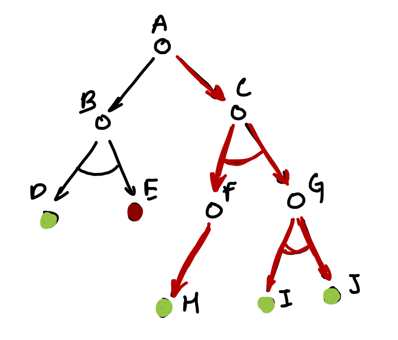
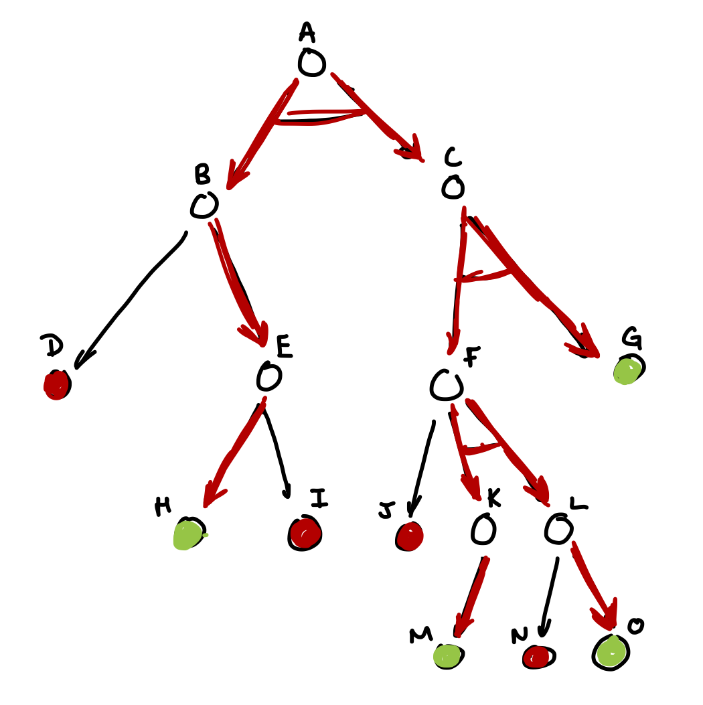
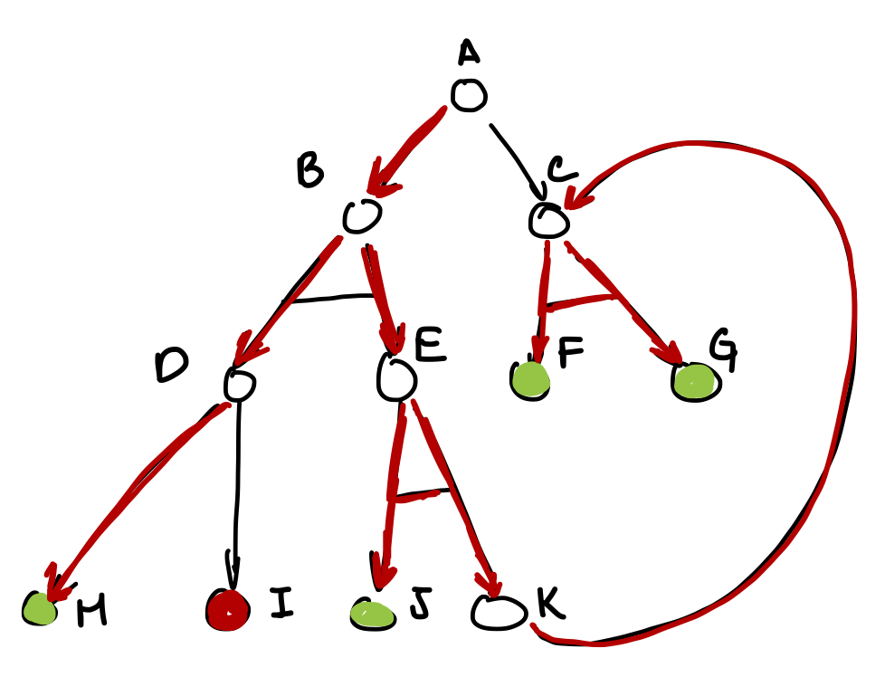
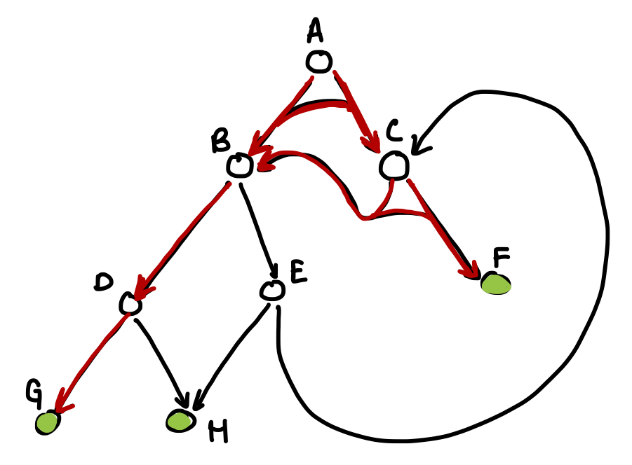
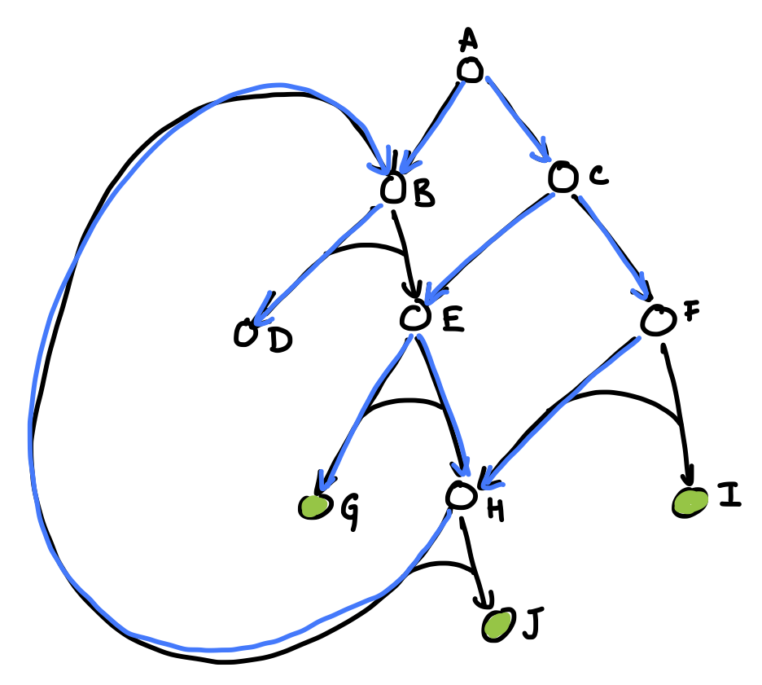

# Código para resolver árboles And-Or

## Índice

1. [¿Para qué es?] ()
2. [¿Cómo se utiliza?] ()
3. [¿Qué archivos lo componen?] ()
4. [¿Cómo funciona?] ()
4.1. [¿Node.java?] ()
4.2. [¿solver.java?] ()

## 1. ¿Para qué es?

El objetivo principal de este código es resolver gráficos And-Or. El archivo completo cuenta con las estructuras utilizadas para crear los nodos y los gráficos; el programa que resuelve los gráficos; un set de 5 gráficos que se pueden utilzar de ejemplo para demostrar el comportameinto del código en diferentes situaciones y un programa que se utiliza para correr dichos ejemplos.

Es importante aclarar que este código únicamente busca la primer ruta viable para resolver el árbol, de manera que esta puede o no ser la más eficiente ya que no considera pesos o costos. Por lo que sólo es útil en los casos en los que se busca resolver el problema sin importar que tan costosa sea la solución.

## 2. ¿Cómo se utiliza?

La descripción de como funciona propiamente el archivo solver.java y Node.java, y como se pueden implementar en sus propios códigos se encuentra más adelante. En esta sección se muestra como utilizar el archivo .jar para demostrar la funcionalidad del código y como interpretar los resultados que muestra.

Para correr el código utliza el comando:

```console
C:\Users\usuario\path\AndOr> java -jar AndOr.jar.
```

en Windows o alternativamente

```console
usuario:AndOr nombre$ java -jar AndOr.jar
```

en Mac o Linux.

Una vez iniciado el programa este te pregunta que ejemplo quieres correr (A,B,C,D o E). En caso de que se introduzca algo diferente el prgorama corre el ejemplo A por default. Los árboles que se utilzian en los ejemplos corresponden a los siguientes:

**A**


**B**


**C**


**D**


**E**


En este punto cabe mencionar que los nombres de los nodos (e.g.: "A", "H", "G",...) son meramente simbólicos y sirven únicamente para mostrar de una manera gráfica el proceso que siguió el programa para buscar la solución. Para interpretar el *output* utilizaremos el árbol A de ejemplo:

Al pedir al código que resuelva el árbol A, el código imprime la secuencia en la que visita los nodos y al llegar a un nodo TRUE o FALSE imprime su valor, e.g.:

```
A
B
D true

E false

C
F
H true

G
I true

J true
```

Adicionalemnte, el código despues imprime los nodos que son parte de la solución.

```
A C F H G I J
```

## 3. ¿Qué archivos lo componen?

El código esta compuesto por tres paquetes: src, Structures y TestTrees; los últimos dos se encuentran dentro del primero. Además de los otros dos paquetes, dentro de src tambien se encuentra el archivo [test.java](./src/test.java), en este se encuentra el método main(), que se encarga de correr los ejemplos para demostrar la funcionalidad del código.

El paquete [Strctures](./src/Strctures) se podría considerar como el principal ya que en el se encuentra el archivo [Node.java](./src/Strctures/Node.java), que es la estructura de datos utilizada para para construir los gráficos y el archivo [solver.java](./src/Strctures/solver.java) que es el objeto con los métodos que resuelven los gráficos y muestran la solución.

Finalmente, en el paquete [TestTrees](./src/TestTrees) se encuentran los gráficos utilizados para los ejemplos.

## 4. ¿Cómo funciona?

A continuación se hace una breve descripción de como funcionan los nodos que conforman los gráficos y el algoritmo que resuelve los mismos.

### 4.1. ¿Node.java?

La estructura de los nodos cuenta con los siguientes atributos:

```java
private long id;
private boolean solution;
private Node[][] children = new Node[0][0];
private Object value;
private boolean assigned = false;
```

 * El id sirve unicamente para identificar cada nodo de manera única.
 * Solution es el valor true/false del nodo, mientras que assigned muestra si solution ya tiene valor.
 * Children tiene los nodos que son ramas del nodo en un array doble de tal forma que: [[A],[B]] los nodos A y B forman una relación OR; mientras que [[A,B]] froma una relación AND
 * Value es un Objeto, para poder guardar la información que sea en el Nodo

### 4.2. ¿solver.java?

El álgoritmo que encuentra las soluciones de los gráficos comienza en el nodo raiz, y navega sus ramas de manera recursiva. El único *input* de la función recursiva es un Nodo y su *output* es un booleano:

```java
  private static boolean findSolution(Node n) {
```

Lo primero que hace la función es imprimir el nodo en el que se encuentra y revisar si el nodo es terminal (que es lo mismo que tenga ramas o no) o si ya ha sido resuelto con anterioridad:

```java
    System.out.print("\n" + n.getValue() + " ");

    if (n.getChildrens().length > 0 && n.checkSolution()) {
```

Posteriormente este comienza a ciclar entre los casos *OR* ({{A},{B},...} para más detalle vea el funcionamiento de los nodos) y para cada uno revisa si estos estan compuestos de varios *AND* ({{A,B,...}}), en caso de que sí, entonces crea una variable "and" que se encarga de trackear si en algun momento algún and no se cumplió y comienza a ciclar por cada rama *AND*:

```java
      for (int i = 0; i < n.getChildrens().length; i++) {

        if (n.getChildrens()[i].length > 1) {
          boolean and = true;

          for (int j = 0; j < n.getChildrens()[i].length; j++) {
```

En caso de que un caso *AND* no sea *true* entonces la variable antes mencionada se pone como false y se interrumpe el *for*, pues no tiene caso continuar evaluandolos:

```java
            if(! findSolution(n.getChildren(i,j))) {
              and = false;
              break;
            }
```

Si termina de ciclar por las ramas *AND* y la variable "and" aún es *true* entonces términa de evaluar y regresa *true*, ya que encontro un camino viable:

```java
          if(and) {
            n.setSolution(true);
            return true;
          }
```

En los casos en los que no hay ramas *AND*, para cada rama *OR* revisa si es viable, en cuyo caso interrumpe el ciclo pues encontró una rama *OR* viable: 

```java
        }else if (findSolution(n.getChildren(i,0))) {
          n.setSolution(true);
          return true;
        }
      }
```

En caso de que termine de ciclar por todos los casos *OR* entonces significa que no encontro ninguna rama viable y por lo tanto este nodo tampoco lo es, por lo que regresa *false*:

```java
      n.setSolution(false);
      return false;
```

Por último, en los casos en los que son nodos terminales o ya han sido evaluados con anterioridad, el algoritmo simplemente regresa el valor del nodo:

```java
    } else {
      System.out.println(n.getSolution());
      return n.getSolution();
    }
```
